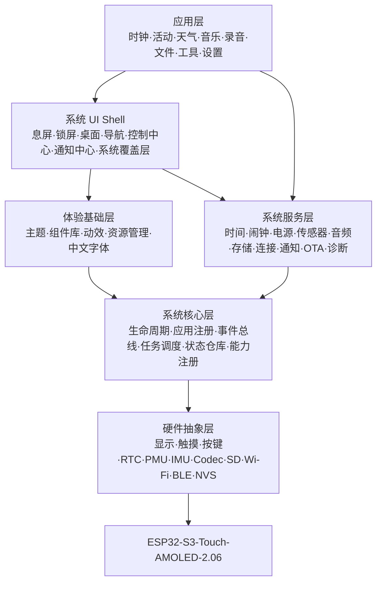
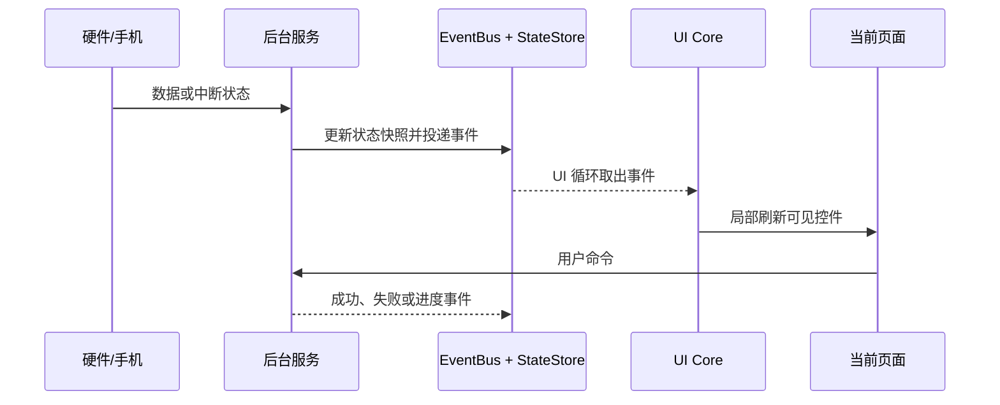
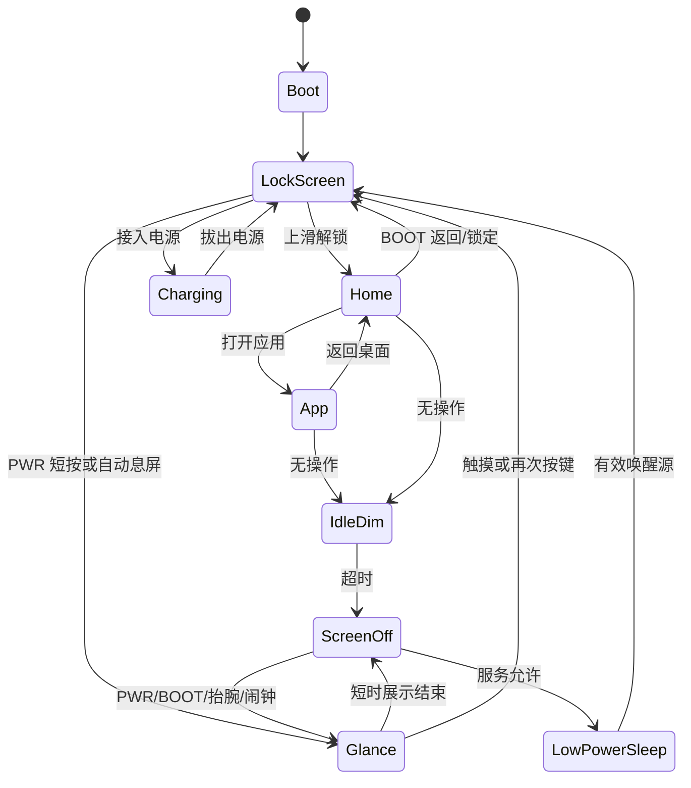

# FireflyOS 系统架构总纲

> 文档版本：1.0  
> 编写日期：2026-06-30  
> 文档性质：系统总体蓝图，不直接等同于各模块的施工方案  
> 目标硬件：Waveshare ESP32-S3-Touch-AMOLED-2.06  
> 技术基线：Arduino + LVGL 8.3.11 + Arduino_GFX

## 1. 文档定位

本文定义 FireflyOS 的长期系统边界、模块关系、产品体验、资源使用原则和演进顺序。后续开发应以本总纲为上位约束，再为 UI Shell、电源、IMU、音频、存储、联网、Android 伴侣应用等板块分别编写详细设计和执行方案。

本文不要求一次性实现所有能力。FireflyOS 应采用“完整规划、分阶段落地”的方式演进，避免为追求表面上的手机功能数量而牺牲流畅度、续航与可维护性。

## 2. 产品定义

### 2.1 一句话定位

FireflyOS 是一套为 410 × 502 AMOLED 手表屏和 ESP32-S3 定制的、以《崩坏：星穹铁道》角色“流萤 / 萨姆”为视觉与叙事核心的轻量级手机式手表系统。

它在交互层借鉴 Android、iOS 与 watchOS 的成熟结构，但不会模拟通用手机操作系统，也不会引入动态进程、动态插件和复杂窗口管理器。

### 2.2 独立与互联关系

系统采用“独立完整、互联增强”原则：

- 没有手机时，时间、闹钟、计时、活动统计、本地音频、录音、文件、主题、系统设置等核心能力仍可正常工作。
- 有手机时，通过 BLE 获得通知同步、天气缓存、媒体控制、找手机、配置同步等增强能力。
- Wi-Fi 按需用于网络校时、天气、OTA 和较大文件传输，不作为后台常驻依赖。
- Android 端应用是系统能力的放大器，而不是手表核心功能的运行前提。
- 不设置强制云账户。云服务若未来加入，只能作为可选层。

### 2.3 产品目标

- 成为可长期日用和持续扩展的嵌入式手表系统，而不只是 UI 演示。
- 尽可能使用屏幕、触摸、RTC、PMU、IMU、音频编解码器、SD、Wi-Fi、BLE 和双核能力。
- 在 400mAh 电池条件下，以正常使用至少一天为续航目标。
- 保持流萤主题的辨识度，同时保证系统信息层级、可读性和操作效率。
- 所有关键功能在离线状态下有明确、可理解的降级行为。
- 通过渐进式模块化重构保留现有可运行功能，避免整体推倒重写。

## 3. 已确认的硬件与限制

### 3.1 硬件能力

| 模块 | 硬件 | 规划用途 |
|---|---|---|
| 主控 | ESP32-S3R8，双核 LX7，最高 240MHz | UI、系统服务、联网和媒体调度 |
| 内存 | 512KB SRAM、8MB PSRAM | SRAM 保留关键实时数据，PSRAM 承担图片和媒体缓存 |
| 存储 | 32MB Flash、Micro SD | 固件与核心资源、可选媒体与用户数据扩展 |
| 显示 | 2.06 英寸 AMOLED，410 × 502，CO5300 | 全屏 UI、低功耗黑色主题、息屏展示 |
| 触摸 | FT3168 电容触摸 | 点击、滚动、边缘下拉和锁屏上滑 |
| RTC | PCF85063 | 断电保持时间、闹钟时间基准 |
| 电源 | AXP2101 | 电量、电压、温度、充电状态和电源策略 |
| 运动 | QMI8658 六轴 IMU | 抬腕、计步、活动统计和简单手势 |
| 音频 | ES8311 + I2S | 铃声、系统提示、本地音乐和录音 |
| 连接 | 2.4GHz Wi-Fi、Bluetooth 5 LE | OTA、天气、校时、手机互联和传输 |
| 按键 | BOOT、PWR | 全局返回、唤醒/息屏和电源菜单 |

### 3.2 不存在或不能可靠提供的能力

- 没有心率、血氧等生理传感器，不生成或伪装医疗健康数据。
- 没有 GPS，不宣称提供独立定位和轨迹记录。
- QMI8658 不含磁力计，不设计真实指南针。
- 当前硬件资料未包含振动马达，因此系统不能把触觉反馈作为必需交互；未来可通过扩展接口增加。
- 400mAh 电池容量要求 Wi-Fi、音频、持续动画和常亮显示全部采用按需策略。

## 4. 现有工程基线与演进判断

### 4.1 已有可复用基础

当前主工程已经具备以下可迁移能力：

- LVGL 显示刷新、触摸输入和 410 × 502 页面搭建。
- 锁屏、桌面、设置、控制中心、充电覆盖层、闹钟覆盖层和息屏页面。
- PCF85063 RTC 同步和手动设置时间。
- AXP2101 电量、电压、温度、VBUS 和充电状态读取。
- 双闹钟数据结构、重复规则、持久化和触发逻辑。
- NVS Preferences 设置保存。
- 壁纸采样主题色、RGB565 壁纸和 PNG 息屏资源链路。
- 双缓冲 120 行、内存不足回退 80 行的显示策略。
- UI 单核访问、后台核只产生事件的保守双核模型。

### 4.2 当前结构需要解决的问题

- `Firefly.ino` 同时承担页面创建、样式、应用入口和设置页面逻辑，继续扩展会形成巨型 UI 文件。
- `FireflyInteraction.cpp` 同时承担按键、休眠、闹钟、电池、充电、页面切换和持久化协调，职责过多。
- `FireflyApp.h` 暴露大量全局 LVGL 指针，页面之间边界不清晰。
- 页面大多在启动时一次性创建，应用数量增加后会持续占用 LVGL 对象和内存。
- 状态模型与控件指针耦合，未来 BLE、Wi-Fi 或 IMU 后台更新容易诱发跨核 UI 风险。

### 4.3 演进原则

- 不重写现有系统；先建立新边界，再把现有功能逐页迁入。
- 每次迁移保持可编译、可启动、可回退。
- 新模块不得直接依赖其他页面的 LVGL 控件。
- 业务状态与 UI 控件分离，后台只更新状态或投递事件。
- 任何进一步扩大双核使用范围的实现，仍需在对应板块施工前单独确认复杂度和风险。

## 5. 总体架构

FireflyOS 采用六层静态模块化架构。应用在编译期注册，运行时按需创建页面，不支持动态二进制插件。



### 5.1 硬件抽象层

职责：

- 隔离具体芯片库和引脚定义。
- 为上层提供稳定、最小的设备接口。
- 统一设备初始化状态、错误码、重试和能力探测。
- 通过 I2C 总线管理器串行访问 RTC、PMU、IMU 和 Codec 控制寄存器。

建议模块：

- `DisplayDevice`
- `TouchDevice`
- `ButtonDevice`
- `RtcDevice`
- `PowerDevice`
- `MotionDevice`
- `AudioCodecDevice`
- `SdDevice`
- `WirelessDevice`
- `PersistentStore`

### 5.2 系统核心层

职责：

- 管理开机、解锁、进入应用、后台、休眠、唤醒和关机等生命周期。
- 维护静态应用注册表和设备能力注册表。
- 使用有界事件队列在后台服务与 UI 之间传递消息。
- 保存面向 UI 的只读状态快照，避免页面直接访问硬件。
- 管理按需任务，禁止每个应用永久占用一个后台任务。

核心组件：

- `SystemLifecycle`：系统状态机。
- `AppRegistry`：静态应用描述、入口、图标、能力要求和页面工厂。
- `AppManager`：应用打开、关闭、挂起和页面回收。
- `EventBus`：固定容量、固定类型的系统事件队列。
- `StateStore`：时间、电池、网络、活动、媒体等状态快照。
- `CapabilityRegistry`：记录硬件是否可用，决定应用或功能是否显示。
- `ResourceGovernor`：约束图片缓存、网络、音频、动画与后台刷新频率。

### 5.3 系统服务层

| 服务 | 核心职责 |
|---|---|
| TimeService | RTC/系统时间同步、时区、格式和网络校时 |
| AlarmService | 闹钟、计时器、秒表和触发历史 |
| PowerService | 电量、充电、亮度、休眠、低电量与热保护 |
| InputService | 触摸活动、BOOT/PWR 语义和全局手势 |
| MotionService | 抬腕、计步、活动统计、手势和 IMU 校准 |
| AudioService | Codec/I2S、音量、铃声、播放和录音会话 |
| StorageService | NVS、内部文件系统、SD、缓存和安全写入 |
| ConnectivityService | BLE、Wi-Fi、配网、会话和离线状态 |
| NotificationService | 本地通知、手机通知、去重、优先级和历史 |
| WeatherService | 手机或 Wi-Fi 来源的天气缓存与过期标记 |
| UpdateService | 固件检查、下载、校验、OTA 与回滚 |
| ThemeService | 主题包、颜色令牌、字体和资源选择 |
| DiagnosticService | 日志、设备自检、资源水位和错误快照 |

### 5.4 体验基础层

该层包含跨页面复用的 UI 资产和规则：

- 颜色、间距、圆角、字体、透明度和动效令牌。
- 状态栏、标题栏、列表项、卡片、滑杆、开关、弹窗和空状态组件。
- 圆角安全区、触摸热区和全屏背景布局。
- 图片句柄、字体句柄和主题资源的生命周期管理。
- 页面预览规格与资源成本清单。

### 5.5 系统 UI Shell

UI Shell 是所有应用共享的“手机系统外壳”，包括：

- 息屏/一瞥界面。
- 锁屏。
- 桌面应用网格。
- 全局状态栏。
- 控制中心。
- 通知中心。
- 应用导航与返回栈。
- 键盘、授权提示、电源菜单和系统级覆盖层。
- 闹钟、低电量、充电、OTA、过热等高优先级界面。

### 5.6 应用层

每个应用只依赖系统服务接口和共享组件库，不直接读取芯片，不直接控制其他应用页面。应用采用按需创建和可回收页面，退出后释放非必要 LVGL 对象与临时资源。

## 6. 依赖与通信规则

### 6.1 依赖方向

- 应用可以调用系统服务，但不能调用 HAL。
- UI Shell 可以读取状态快照和调用服务命令，但不能执行阻塞式硬件访问。
- 系统服务通过 HAL 访问硬件。
- HAL 不依赖 LVGL、应用或主题。
- 模块间不得通过其他模块的全局 LVGL 指针通信。

### 6.2 数据流



### 6.3 事件设计

- 高频数据使用“最新状态快照 + 单个刷新事件”，不排队保存每个采样点。
- 关键事件包含闹钟触发、低电量、SD 移除、网络变化、手机断连和 OTA 状态。
- 事件负载优先使用固定大小结构和枚举，避免热路径频繁创建 `String` 和堆对象。
- 队列满时保留关键事件，允许丢弃可重建的低优先级刷新事件。

## 7. 运行与双核模型

### 7.1 核心边界

- UI 核独占 LVGL、页面对象、动画和显示刷新。
- 后台核负责按键检测、休眠判定、传感器采样、连接状态和非 UI 计算。
- 后台核不得调用 `lv_obj_*`、`lv_label_*`、`lv_img_*` 等 LVGL API。
- RTC、PMU、IMU、Codec 控制寄存器共享 I2C 时，必须通过统一锁或总线管理器串行访问。

### 7.2 任务策略

- 保留一个长期运行的轻量系统工作任务，而不是为每个服务创建永久任务。
- 音频、OTA、大文件传输等任务只在会话期间创建，结束后释放。
- UI 更新采用事件驱动；隐藏页面停止刷新定时器。
- 不允许 Wi-Fi 扫描、SD 大文件读写、PNG 解码在 UI 回调中同步执行。
- 所有新增双核并发方案必须在对应详细方案中给出竞争资源、队列容量、栈大小和退出路径，再由用户确认。

## 8. 系统状态与生命周期

### 8.1 系统状态



### 8.2 息屏策略

- 默认采用“短时一瞥 + 真正关屏/低功耗”模式，不默认持续常亮。
- 一瞥界面显示时间、日期、关键状态和一张低成本流萤主题图。
- 纯黑区域优先，避免 AMOLED 无效发光与长期静态元素烧屏风险。
- 进入低功耗前停止动画、降低传感器采样、关闭 Wi-Fi、暂停非必要刷新。
- 深度睡眠只在 RTC、按键和 IMU 唤醒链路经过硬件验证后启用；首选可稳定恢复 UI 的轻睡眠方案。

### 8.3 实体按键

- BOOT 短按：应用内返回；桌面返回锁屏；设置子页返回上一级。
- PWR 短按：唤醒或息屏。
- PWR 长按：电源菜单，包括息屏、重启和关机。
- 闹钟等高优先级覆盖层出现时，按键优先执行对应安全操作。

## 9. 手机式导航结构

### 9.1 页面层级

```text
一瞥/息屏
└── 锁屏
    └── 桌面
        ├── 应用网格（分页）
        ├── 顶部下拉：控制中心 / 通知中心
        ├── 应用页面
        │   └── 应用子页面 / 编辑页面
        └── 系统覆盖层
```

### 9.2 手势与导航

- 锁屏上滑进入桌面。
- 桌面和应用从顶部边缘下拉打开统一面板；面板内切换“控制”和“通知”。
- 桌面使用三列应用图标和水平分页，每页最多六个主入口，避免密集滚动。
- 应用内部以垂直滚动为主，避免与全局返回手势冲突。
- BOOT 承担可靠的全局返回，因此不强制加入容易误触的边缘返回手势。
- 状态栏只显示时间、电量、连接和必要状态，不复制手机的全部图标。

### 9.3 覆盖层优先级

从高到低：

1. 关机、严重过热、OTA 不可中断阶段。
2. 闹钟和极低电量。
3. 授权、配对和错误确认。
4. 充电提示、来通知提示。
5. 控制中心、通知中心和普通弹窗。

## 10. UI 安全区与组件原则

### 10.1 410 × 502 画布

- 背景图片允许铺满 410 × 502。
- 常规交互内容以左右至少 24px、顶部至少 24px、底部至少 32px 为基础安全边距。
- 顶部角落和底部主要按钮应进一步内缩；最终数值由真机圆角遮挡测试校准。
- 常用触摸目标不小于 48 × 48px，主要按钮建议不小于 56px 高。
- 关键操作不能只依赖被圆角切割区域中的小图标。

### 10.2 组件层级

- 一级页面：全屏背景 + 固定头部 + 主内容区。
- 二级页面：统一返回语义、标题位置和内容安全区。
- 卡片：优先使用实色或局部半透明，不在全屏滑动时叠加高成本模糊与阴影。
- 弹窗：只显示必须立即决策的信息，避免在小屏上堆叠多按钮。
- 列表：每行只保留一个主标题、一个辅助值和一个主操作。

### 10.3 字体

- 系统语言以简体中文为主。
- 数字时间继续使用 Montserrat 或同等紧凑数字字体。
- 中文采用离线转换后的紧凑字库；系统固定文案优先使用字形子集。
- 手机通知等不可预测文本需规划扩展中文字库和缺字回退，不能假设固定子集覆盖全部文本。
- 建议字号：正文 18–20px、列表主标题 20–22px、页面标题 22–24px、大时间 40–48px。

## 11. 流萤 / 萨姆视觉体系

流萤的官方设定同时具有“以普通人的身份寻找生命意义”和“身着萨姆装甲执行使命”的双重面向。因此系统不应只把她当作壁纸人物，而应将这种双层气质映射到日常与关键状态。角色参考见 [HoYoLAB 官方角色介绍](https://www.hoyolab.com/article/29770753)。

### 11.1 双层视觉语义

- 日常层“Firefly”：柔和、克制、清澈、带有微光和生命感，用于锁屏、桌面、普通应用和设置。
- 守护层“SAM”：机械、锐利、点火、保护和高能量，用于启动、闹钟、低电量、OTA、性能模式和严重警报。
- 两层共享同一套布局与组件，不建设两套互不兼容的 UI。

### 11.2 建议色彩令牌

| 令牌 | 建议颜色 | 用途 |
|---|---|---|
| `bg_base` | `#05090C` | AMOLED 主背景 |
| `bg_surface` | `#0C1820` | 卡片和面板 |
| `firefly_primary` | `#5FE7C7` | 日常主强调色 |
| `firefly_secondary` | `#6EC4D6` | 次强调与连接状态 |
| `starlight` | `#D8F7EE` | 主文字与微光 |
| `dream_violet` | `#A89BCB` | 次级主题点缀 |
| `sam_energy` | `#A8FF60` | SAM 能量状态 |
| `sam_ignition` | `#FF8A45` | 启动、警报和高能状态 |
| `critical` | `#FF5A5F` | 仅用于真正危险状态 |

所有颜色在进入固件前应预计算 RGB565 值，并在真机上校正 AMOLED 偏色。

### 11.3 形状语言

- 普通卡片使用柔和大圆角，体现流萤的人性与亲和感。
- 关键状态在卡片角部加入少量机甲切角或能量边线，体现萨姆而不牺牲可读性。
- 装饰图形优先使用萤火、星轨、装甲分缝和能量翼的抽象符号。
- 不在每个页面重复角色立绘；角色图像集中用于锁屏、息屏、主题和少量庆祝场景。

### 11.4 动效

- 普通转场建议 160–220ms，关键确认反馈 100–160ms。
- 只对小范围对象使用透明度、位移或缩放动画。
- 禁止持续粒子、实时模糊、大面积透明层跟随滑动和多层阴影。
- SAM 点火效果使用预渲染少帧序列或短促几何动效，不使用高帧率全屏 GIF。
- 动效在低电量、过热和省电模式下自动关闭。

### 11.5 主题包与公开发布边界

- 系统内核、系统服务、应用逻辑和通用组件不依赖任何具体角色素材。
- “流萤 / 萨姆”作为默认主题包实现，通过颜色令牌、图标、壁纸、息屏图和提示音接入。
- 公开发布时保留一套不含角色素材的中性基础主题，流萤主题可作为用户自行安装或仅限个人使用的资源包。
- 主题包只允许替换表现资源和设计令牌，不允许携带可执行代码或越过系统服务直接访问硬件。
- 当前设置壁纸自动取色能力归入 `ThemeService`：导入新壁纸时采样一次并缓存主题令牌，正常页面显示时不重复采样。

## 12. UI 修改前的预览审批流程

任何影响系统视觉或交互的修改，在编码前必须先提交预览：

1. 使用 410 × 502 精确画布绘制预览。
2. 标出圆角安全区、触摸热区和滚动范围。
3. 至少展示默认、交互中和异常/空状态。
4. 对全局页面同时展示与锁屏、桌面、控制中心的风格对比。
5. 附带图片格式、尺寸、预计 Flash/RAM 占用和是否需要运行时解码。
6. 用户确认后，才进入实现与真机校准。
7. 真机结果与预览偏差明显时，重新出图确认，不直接反复盲调代码。

预览可以使用 HTML/CSS 高保真稿、PNG 画板或其他可复核形式，但最终必须以 410 × 502 真机画布为准。

## 13. 应用版图

### 13.1 系统壳与核心应用

| 模块 | 独立运行 | 手机增强 | 说明 |
|---|---:|---:|---|
| 锁屏/桌面 | 是 | 可同步主题 | 系统入口 |
| 控制中心 | 是 | 显示连接状态 | 亮度、音量、网络、省电等快捷控制 |
| 通知中心 | 是 | 是 | 本地通知始终可用，手机通知可选 |
| 时钟中心 | 是 | 可校时 | 时间、闹钟、计时器、秒表 |
| 日历 | 是 | 可同步摘要 | 本地日期浏览和简要日程 |
| 设置 | 是 | 可远程配置 | 系统全部设置的本地入口 |
| 电源中心 | 是 | 可查看状态 | 电量、温度、续航和省电策略 |

### 13.2 硬件能力应用

| 应用 | 功能边界 |
|---|---|
| 活动 | 抬腕、计步、活动时长和简单目标；不提供医疗结论 |
| 音乐 | 播放 SD/内部存储的支持格式音频，提供基础播放队列 |
| 录音 | 语音备忘录、录音列表和 SD 保存 |
| 文件 | 浏览 SD 中 FireflyOS 管理目录，不做通用复杂文件管理器 |
| 图库与主题 | 壁纸、息屏图和主题包预览、安装与切换 |
| 系统诊断 | 硬件状态、内存、存储、日志和自检；默认作为开发者入口 |

### 13.3 联网与手机增强应用

| 应用/能力 | 离线行为 | 连接后行为 |
|---|---|---|
| 天气 | 显示最近缓存并标记更新时间 | 手机同步或 Wi-Fi 更新 |
| 手机通知 | 显示历史缓存或空状态 | 接收 Android 通知摘要 |
| 媒体遥控 | 显示未连接状态 | 播放/暂停、切歌、音量控制 |
| 找手机 | 不可用但不影响系统 | 触发手机响铃 |
| 找手表 | 手表端无需依赖 | 手机触发手表声光提示 |
| 配置同步 | 使用本地设置 | 同步主题、闹钟、天气城市等非关键配置 |

### 13.4 工具应用

- 计算器。
- 屏幕手电筒，限制最大持续时间并提示高功耗。
- 倒计时快捷工具。
- 设备信息。

不规划真实指南针、独立导航或伪健康监测。

## 14. Android 伴侣应用与通信架构

### 14.1 分工

Android 应用负责：

- 首次 BLE 配对与设备命名。
- 通知读取权限和通知摘要转发。
- 天气、日程摘要和手机电量等增强数据同步。
- 闹钟、主题、快捷开关等远程配置。
- 找手机/找手表和媒体控制。
- Wi-Fi 凭据安全下发。
- OTA 包选择、传输进度和版本管理。
- 大文件传输时协调手表进入临时 Wi-Fi 传输模式。

### 14.2 连接策略

- BLE 是低功耗常规控制通道。
- Wi-Fi 默认关闭，只在 OTA、天气直连或大文件会话中开启。
- BLE 负责协商 Wi-Fi 会话，避免手表长期扫描网络。
- 断连不会阻塞本地 UI，也不会阻止闹钟、时间、活动和本地媒体运行。

### 14.3 协议原则

- 协议包含版本号、消息类型、序号、长度、校验和确认机制。
- 大数据分片传输，支持超时、重试、取消和断点恢复策略。
- 设置同步带时间戳或修订号，冲突时以用户最近明确操作为准。
- 手机通知只保存必要字段，限制数量、长度和图片传输。
- 配对后保存设备密钥或令牌，敏感命令拒绝未配对客户端。
- Android 协议细节另立文档，不把手机平台代码耦合进手表应用层。

## 15. 数据与存储架构

### 15.1 分层存储

| 存储 | 内容 |
|---|---|
| NVS Preferences | 小型设置、闹钟、配对信息、版本化配置 |
| 固件 Flash | 程序、核心字体、默认主题、必要图标和启动资源 |
| 内部文件系统 | 缓存、轻量日志、天气/通知摘要和迁移数据 |
| Micro SD | 音乐、录音、扩展主题、壁纸、备份和 OTA 暂存 |

### 15.2 SD 目录建议

```text
/FireflyOS/
├── Music/
├── Recordings/
├── Pictures/
├── Themes/
├── Updates/
├── Backups/
└── Logs/
```

### 15.3 一致性与安全写入

- 所有配置结构带版本号，固件升级时执行明确迁移。
- 重要文件采用临时文件写入、校验后替换，避免断电损坏。
- SD 拔出时停止新写入、关闭句柄并通知可见应用降级。
- 高频计步数据在 RAM 聚合后批量保存，避免频繁磨损 Flash。
- 日志使用固定上限的环形策略，不允许无限增长。

## 16. 资源与性能预算

### 16.1 内存分工

- 内部 SRAM：LVGL draw buffer、RTOS 栈、事件队列、I2C/输入关键数据。
- PSRAM：图片解码缓存、媒体缓冲、较大页面模型、文件传输缓冲。
- 关键中断和 DMA 所需缓冲必须使用满足能力要求的内存区域。
- 所有模块在最坏场景下保留至少 15% 的对应内存余量。

### 16.2 UI 资源

- 保留当前 120 行双 draw buffer，分配失败回退 80 行。
- 全屏 RGB565 资源约为 `410 × 502 × 2 ≈ 402KiB/张`，核心固件中严格限制数量。
- 默认主题保留少量编译内置全屏资源，扩展壁纸和主题优先放入 SD。
- 图标优先使用单色字形、A8/Alpha 蒙版或小尺寸 RGB565，避免每个图标使用大 PNG。
- 页面按需创建；Shell、状态栏和必要覆盖层常驻，普通应用退出后可释放。

### 16.3 性能验收目标

- 触摸到可见反馈通常不超过 100ms。
- 普通转场目标 25–30fps，不允许出现超过 250ms 的无反馈阻塞。
- UI、音频、网络和存储并发时不得发生 LVGL 跨核访问或看门狗复位。
- 应用退出后临时内存应回到稳定基线，不允许持续增长。
- UI 任务和后台任务保留至少 25% 栈高水位余量。
- 资源不足时优先关闭动画、降低缓存或拒绝启动非关键会话，而不是让系统崩溃。

### 16.4 Flash 与 OTA

- 32MB Flash 使用自定义分区方案，兼顾双 OTA 分区、NVS、内部文件系统和固件资源。
- OTA 分区大小必须以实际固件二进制尺寸加至少 20% 余量确定。
- 新增大型内置资源前必须检查两个 OTA 槽是否仍能容纳完整固件。
- 若主题或媒体资源导致固件膨胀，应迁移至 SD/内部文件系统，不牺牲 OTA 回滚能力。

## 17. 功耗与 400mAh 电池策略

### 17.1 续航目标

400mAh 电池实现 24 小时续航要求整机平均电流低于约 16.7mA。FireflyOS 将代表性日常使用平均电流目标设为不高于 14mA，为电池老化和峰值活动留出余量。

### 17.2 功耗规则

- AMOLED 默认深色，黑色作为真实背景而非装饰层。
- 默认不常亮；一瞥结束后关屏并进入低功耗状态。
- Wi-Fi 不后台常驻，扫描和传输设置超时。
- BLE 使用低频连接参数，只有同步期间临时提高吞吐。
- IMU 平时使用低功耗采样，进入活动页面时再提升频率。
- 音频 Codec、功放和 SD 在无会话时断电或休眠。
- 充电时允许更高刷新与联网，但不改变关键温度保护。
- 电量低时关闭高成本动效、Wi-Fi 自动更新和屏幕手电筒。

### 17.3 电源等级

- 正常：全部已启用功能可按需运行。
- 省电：降低亮度、动效、IMU 频率和同步频率。
- 低电量：禁止 OTA、Wi-Fi 大传输和屏幕手电筒。
- 极低电量：保存状态、发出明确提示并安全关机。
- 充电：显示充电状态、温度和预计行为，不强制全屏长期常亮。

## 18. 音频架构

- `AudioService` 独占 I2S 会话和 ES8311 状态。
- 铃声拥有高于音乐的优先级，可暂停音乐后播放。
- 录音与播放互斥，避免在首版实现复杂全双工混音。
- 首期统一使用低成本 PCM/WAV 链路；压缩格式按实际解码负载逐项评估。
- 音乐和录音数据优先存储于 SD。
- 系统提示音短小、预加载或使用轻量生成音，避免每次读取大文件。
- Codec 初始化失败时，闹钟仍显示全屏警报；系统清楚提示音频不可用。
- 不在首期规划语音助手。

## 19. IMU 与活动架构

- 后台低频采样用于抬腕和活动检测。
- 计步算法以可重复、可校准为目标，不宣称医疗或专业运动精度。
- 活动页面打开时可临时提高采样频率显示方向和运动图表。
- 原始 IMU 数据不长期保存，默认只保存按日聚合的步数与活动时长。
- 抬腕亮屏包含冷却时间、姿态阈值和误触抑制。
- 跌倒与睡眠只能作为未来实验功能，不能进入首期稳定功能承诺。

## 20. 可靠性、错误与降级

### 20.1 硬件能力降级

- RTC 失败：继续使用系统时间并提示重新校时。
- PMU 失败：隐藏不可信电量，保留基础 UI，不显示虚假百分比。
- IMU 失败：关闭抬腕和活动入口，其他系统正常。
- SD 不存在：音乐、录音、主题只显示内部可用内容。
- Codec 失败：视觉闹钟和通知继续工作。
- BLE/Wi-Fi 失败：所有本地应用继续工作，连接功能显示离线。

### 20.2 系统保护

- 启动时运行轻量设备自检并生成能力表。
- 关键服务失败有有限次数重试，禁止无间隔死循环。
- 看门狗覆盖 UI 主循环和长时间后台任务。
- 错误日志写入有界环形缓存，必要时导出到 SD 或手机。
- OTA 使用校验、双分区和启动确认；新固件启动失败时回滚。
- 低内存时进入资源保护模式，禁止打开媒体或大型主题预览。

## 21. 安全与隐私

- BLE 初次连接要求用户在手表端确认配对。
- 保存配对身份并允许用户从手表设置中解除绑定。
- Wi-Fi 密码只保存于受控配置区，不写入普通日志。
- 通知内容支持在锁屏隐藏正文。
- 录音必须有持续可见的录制状态，不能静默后台录音。
- OTA 包必须校验完整性；公开发布阶段应加入签名验证。
- 恢复出厂设置清除配对、网络、通知、个人设置和缓存，不默认删除 SD 中用户媒体，除非用户明确选择。

## 22. AI 美术生成规范

### 22.1 通用应用图标提示词

将 `[应用名称]` 和 `[核心象征]` 替换为具体内容：

```text
为 410×502 AMOLED 智能手表系统设计一个“[应用名称]”应用图标，核心象征为“[核心象征]”。视觉灵感来自《崩坏：星穹铁道》流萤的清澈生命感与萨姆装甲的未来机械结构，但不要直接绘制人物肖像，也不要复制游戏官方徽标。深黑底兼容，高对比度，萤火青绿色与浅青色为主，少量淡紫色点缀，加入极少量装甲切角和能量翼线条。几何造型简洁，单一中心符号，轮廓粗而清晰，适合缩小到 64–72 像素，扁平化，最多三层明暗，不使用细碎纹理，不使用文字。正方形画布，图标居中，四周留出 18% 安全边距，透明背景，干净边缘，UI asset, vector-like, production ready.
```

### 22.2 SAM 系统警报图标提示词

```text
设计一个 FireflyOS 系统警报图标，灵感来自萨姆装甲点火、守护与高能量状态。使用深石墨黑、荧光黄绿色和少量点火橙色，机械切角、对称能量核心、粗轮廓、高对比度。图形必须在 48–64 像素仍然清楚，不绘制完整机甲人物，不使用文字，不使用复杂火焰，不使用官方徽标，透明背景，扁平化矢量风格，最多三种主色，适合 AMOLED 手表系统。
```

### 22.3 壁纸提示词

```text
为 410×502 竖向圆角 AMOLED 手表屏设计 FireflyOS 系统壁纸。主题是流萤、生命微光、星海与格拉默未来感：深黑和深蓝黑大面积留白，青绿色萤火微光形成柔和视觉焦点，少量淡紫与银白星轨，画面安静、清澈、有希望感；边缘和顶部状态栏区域保持低细节，底部应用图标区域保持足够暗，不放文字，不放 UI，不使用密集粒子，不让人物面部位于圆角裁切区。适合 RGB565 转换，避免大面积细腻渐变和高频噪点，竖版 410:502 构图。
```

### 22.4 息屏图提示词

```text
设计一张适合 AMOLED 息屏界面的流萤主题小型插画，主体集中在中央 200×200 安全区域，背景纯黑，青绿色萤火和柔和能量翼构成简洁轮廓，表达微弱却坚定的生命之光。高对比、低色彩数量、无文字、无复杂背景、边缘干净，适合缩小和 PNG 透明通道，避免连续动画感和细碎光点。
```

### 22.5 通用反向提示词

```text
no text, no letters, no watermark, no logo, no busy background, no photorealism, no tiny details, no thin outline, no excessive glow, no heavy gradient, no dense particles, no complex character pose, no cropped symbol, no low contrast, no multiple focal points
```

### 22.6 资源落地流程

1. AI 先生成 512 或 1024 像素母图。
2. 人工检查轮廓、对称、版权标识和小尺寸辨识度。
3. 离线缩放到实际尺寸，并在 410 × 502 预览稿中验证。
4. 根据用途转换为单色字形、Alpha 蒙版、RGB565 或压缩 PNG。
5. 记录 Flash 体积、解码 RAM 和首次显示耗时。
6. 用户批准预览后才加入固件或主题包。

## 23. 测试与验收体系

### 23.1 逻辑测试

- 时间、闹钟、重复日期、跨日与时区。
- 设置序列化、版本迁移和恢复默认值。
- 事件队列优先级、溢出和去重。
- BLE 协议分片、校验、重试和冲突解决。
- 功耗状态机和唤醒条件。
- 计步聚合和数据持久化边界。

### 23.2 UI 测试

- 每个页面的 410 × 502 预览和真机截图对比。
- 四角、底部按钮、键盘和长文本的裁切检查。
- 空数据、硬件缺失、断网、SD 拔出和低电量状态。
- 连续打开/关闭应用后的对象和内存稳定性。
- 控制中心、通知中心和系统覆盖层优先级。

### 23.3 硬件与稳定性测试

- 24 小时运行与闹钟准点测试。
- 真实 400mAh 电池场景的平均电流和续航测试。
- 充电、拔插 SD、BLE 反复连接和 Wi-Fi 失败恢复。
- 音频播放/录音与 UI 并发。
- IMU 抬腕误触率和计步对比测试。
- OTA 成功、断电中断和回滚测试。

## 24. 分阶段实施路线

### 阶段 0：基线冻结与测量

- 记录当前固件大小、内存、启动时间、转场表现和功耗。
- 保存现有核心页面真机截图和交互行为。
- 建立 UI 预览模板、设计令牌和验收表。

### 阶段 1：系统核心与 UI Shell

- 建立 HAL、EventBus、StateStore、AppRegistry 和基础生命周期。
- 将状态栏、控制中心、通知中心、导航和覆盖层收归 Shell。
- 保持现有锁屏、桌面、设置和息屏行为可用。

### 阶段 2：迁移现有核心功能

- 迁移时间、双闹钟、电池、亮度、音量和自动息屏。
- 拆分当前巨型 UI 构建文件和全局控件指针。
- 形成统一组件库和中文 UI 基线。

### 阶段 3：真实低功耗与 IMU

- 接入 QMI8658、抬腕、计步和活动应用。
- 完成 IdleDim、ScreenOff、LightSleep 和唤醒链路。
- 在 400mAh 电池上建立真实功耗曲线。

### 阶段 4：SD 与音频

- 建立 StorageService、SD 热插拔和 FireflyOS 目录。
- 接入 ES8311/I2S、铃声、音乐和录音。
- 实现文件、音乐、录音和主题资源管理。

### 阶段 5：BLE 与 Android 伴侣基础

- 定义版本化 GATT/消息协议。
- 实现配对、设备信息、设置同步、通知摘要和媒体控制。
- 开发 Android 端最小可用伴侣应用。

### 阶段 6：Wi-Fi、天气与 OTA

- BLE 配网、按需联网、NTP 和天气缓存。
- 双分区 OTA、校验、回滚和 Android 端更新流程。
- 大文件传输切换至临时 Wi-Fi 会话。

### 阶段 7：视觉统一与发布准备

- 完成流萤/SAM 双层视觉体系和主题包。
- 完成全部页面预览、真机校准和资源压缩。
- 进行长稳、续航、错误恢复和发布安全审查。

## 25. 后续详细方案目录

后续每个板块应独立完成“设计 → 预览/验证 → 执行计划 → 实现 → 测试”：

1. FireflyOS UI Shell 与导航详细方案。
2. 流萤/SAM 视觉规范、组件库与页面预览方案。
3. 应用注册、生命周期与事件总线详细方案。
4. 电源管理、低功耗与 400mAh 续航方案。
5. 时间、闹钟、计时器和日历方案。
6. QMI8658、抬腕、计步和活动应用方案。
7. ES8311/I2S、铃声、音乐和录音方案。
8. SD、内部文件系统、文件与主题包方案。
9. BLE 协议与 Android 伴侣应用架构方案。
10. Wi-Fi、天气、NTP、文件传输和 OTA 方案。
11. 中文字体、图标资源和 AI 美术生产方案。
12. 测试、性能、功耗、诊断和发布验收方案。

## 26. 总体成功标准

FireflyOS 达到以下条件时，可认为总体架构目标已经实现：

- 手表脱离手机后仍是功能完整、行为清楚的小型独立设备。
- 与 Android 手机连接后获得通知、天气、控制和维护能力，但断连不破坏核心功能。
- 所有硬件由明确服务管理，不出现页面直接抢占总线或跨核访问 LVGL。
- 新应用可以通过静态注册接入，而不继续扩大单体入口文件。
- UI 在圆角屏上安全、统一、可读，且每次修改前都有可审批预览。
- 流萤与萨姆的角色主题体现在系统语义和视觉层级中，而不是只依赖壁纸。
- 400mAh 条件下正常使用达到至少一天，并具有可解释的省电与降级策略。
- 固件保有 OTA 回滚、资源余量、错误日志和长期维护能力。

---

本总纲是 FireflyOS 后续设计与开发的上位文档。若具体板块方案与本总纲冲突，应先更新并重新确认总纲，而不是在实现中形成隐性例外。
